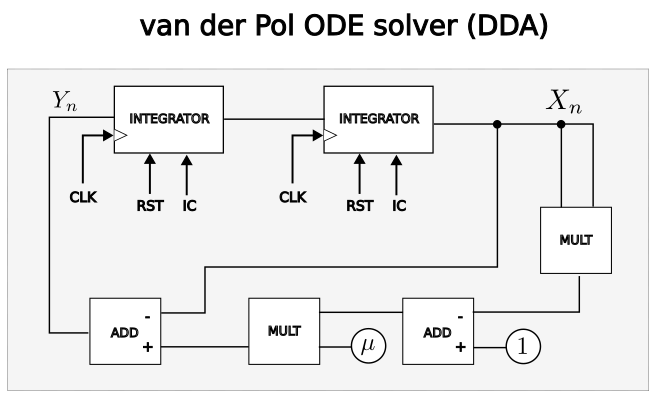

  

# Hardware solver for van der Pol oscillator

16-bit [ASIC](https://en.wikipedia.org/wiki/Application-specific_integrated_circuit) solver for the [van der Pol](https://en.wikipedia.org/wiki/Van_der_Pol_oscillator) nonlinear differential equation submitted to [TinyTapeout 7](https://tinytapeout.com). 
- [Read the technical documentation for this project](docs/info.md)

## What is a DDA solver?

A Digital Differential Analyzer (DDA) is a digital circuit that uses integrators to solve differential equations in digital systems. This project implements an Euler integration algorithm in hardware using an alternative to the IEEE-754 floating point numerical system called Posit (see [below](#what-are-posit-numbers-)). To program a DDA one has to wire basic components such as adders, multipliers and integrators together to express the desired set of equations that describes the dynamical system, in a similar fashion as the old [analog computers](https://www.analogmuseum.org/english/) were programmed. 

The van der Pol oscillator is decribed by the second order nonlinear ordinary differential equation (ODE) given by $\ddot{x} - \mu(1-x^2)\dot{x} -x = 0$ where $\dot{x}$ denotes the derivative of the position coordinate with respect to time and $\mu$ is a scalar parameter. It can be rewritten in terms of two coupled first order equations:

$$
\begin{align}
\dot{x} &= y\\
\dot{y} &= \mu(1-x^2)y - x\\
\end{align}
$$

This set of coupled ODEs can be implemented in digital circuit as shown in the diagram below. At each DDA clock the integrators calculate the solutions for one time step $dt$.

For simplicity and limited chip area the time step is fixed by $dt = 1/256$ which proved to be enough given the precision of Posit(16,1) used in the arithmetic modules.

## What are posit numbers ?

Posit number is a new way to encode and operate with floating point numbers in digital systems that is gaining attention for application in AI hardware accelerators. Compared to standard IEEE 754 floating-point format, Posits offer a few advantages including the ability to get more precision or dynamic range out of a given number of bits allowing a hardware designer to tailor 

Dynamics range is given by $(2n-4)2^{es}\log_{10}2$

## Resources

- [FAQ](https://tinytapeout.com/faq/)
- [Digital design lessons](https://tinytapeout.com/digital_design/)
- [Learn how semiconductors work](https://tinytapeout.com/siliwiz/)
- [Join the community](https://tinytapeout.com/discord)
- [Build your design locally](https://docs.google.com/document/d/1aUUZ1jthRpg4QURIIyzlOaPWlmQzr-jBn3wZipVUPt4)

