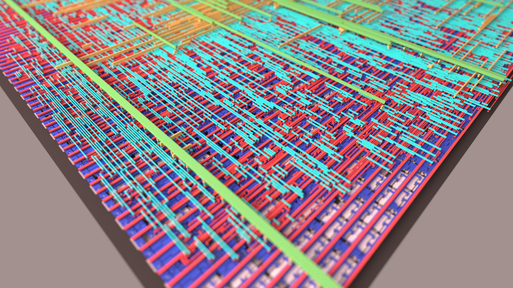
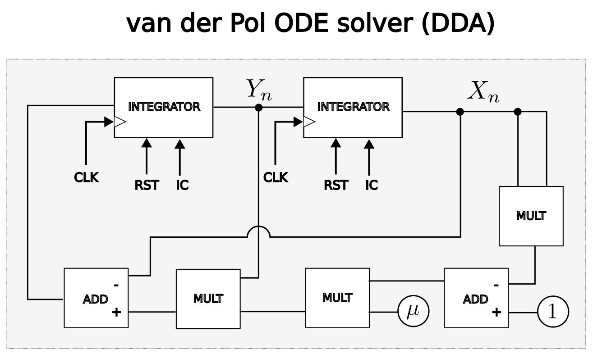
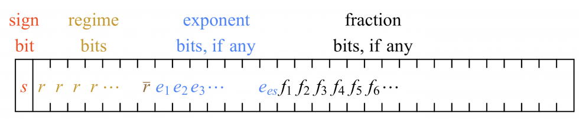
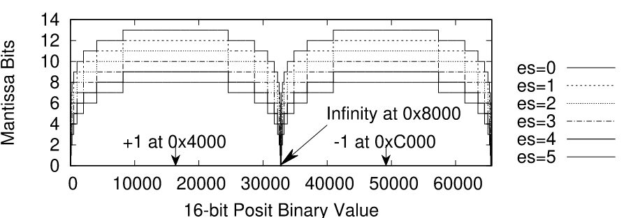

  

# DDA solver for van der Pol oscillator

Open-source [ASIC](https://en.wikipedia.org/wiki/Application-specific_integrated_circuit) solver for the [van der Pol](https://en.wikipedia.org/wiki/Van_der_Pol_oscillator) nonlinear oscillator using 16-bit posits submitted to [TinyTapeout 7](https://tinytapeout.com). 
- [Read the technical documentation for this project](docs/info.md)

## What is a DDA solver?

A Digital Differential Analyzer (DDA) is a digital circuit that uses integrators to solve differential equations in digital systems. This project implements an Euler integration algorithm in hardware using an alternative to the IEEE-754 floating point numerical system called Posit (see [below](#what-are-posit-numbers)). To program a DDA one has to wire basic components such as adders, multipliers and integrators together to express the desired set of equations that describes the dynamical system, in a similar fashion as the old [analog computers](https://www.analogmuseum.org/english/) were programmed. 

The van der Pol oscillator is decribed by the second order nonlinear ordinary differential equation (ODE) given by $\ddot{x} - \mu(1-x^2)\dot{x} -x = 0$ where $\dot{x}$ denotes the derivative of the position coordinate with respect to time and $\mu$ is a scalar parameter. It can be rewritten in terms of two coupled first order equations:

$$
\begin{align}
\dot{x} &= y\\
\dot{y} &= \mu(1-x^2)y - x\\
\end{align}
$$

The phase portraits for varying parameter $\mu$ are shown below. When $\mu=0$ there is no dumping and the system behaves as a harmonic oscillator. For $\mu > 0$ the oscillator converges to a globally unique limit cycle and shows relaxation oscillations without external forcing.

The set of coupled ODEs can be implemented in digital circuit as shown in the diagram below. At each DDA clock the integrators calculate the solutions for one time step $dt$.

For simplicity and limited chip area the time step is fixed by $dt = 1/256$ which proved to be enough given the precision of posit(16,1) used in the arithmetic modules.

## What are posit numbers

[Posit](https://spectrum.ieee.org/floating-point-numbers-posits-processor) number offers a new way to encode and operate with floating point numbers in digital systems that is gaining attention for its applications in AI hardware accelerators. Compared to the standard IEEE-754 floating-point format, posits offer a few advantages including the ability to trade off between precision and dynamic range for a given number of bits allowing hardware optimizations to specific applications.

For numerical applications, the IEEE-754 has many drawbacks that can produce inconsistencies and wrong results. 

A posit format is defined by the combinations of its word size (N) and exponent size (es) as a tuple (N,es). In this project posits (16,1) were used, meaning 16-bit word and 1-bit exponent sizes. Different choices of ES is possible leading to distinct dynamic ranges and precisions.

The composition of a posit enconding is shown in the figure below. It consists of:

- Sign bit (s): **0** for positive and **1** for negative
- Regime bits (r): sequences of either all 0 or 1, terminated by an opposite bit. Its value is determined by its run-length. For instance, a sequence of **m** bits **0** terminated by **1** defines negative regime-bit value of **k = -m** , e.g. (**0001** -> -3). For a sequence of **m** bits **1** terminated by a bit **0** the positive regime-bit value is defined by **k = m-1**, .e.g (**1110** -> k = 2).
- Exponent bits (e): unsigned integer which can be maximum of ES bits in lenght. 
- Fraction bits (f): any remaining bits after the regime and exponent bits (if any) define the fraction **1.f** as in a float number (there are no subnormals in posits). The maximum fraction bits width is N-es-3. 

Dynamic range is usually measured in decades and it is defined by the logarithm base 10 of the ratio between the largest and the smallest representable numbers. The largest posit number, called **maxpos**, occurs when *k* is as large as possible, when all the bits after the sign bit are **1**s (*k = N-2*) and is given by

$$
maxpos = (2^{2^{es}})^{N-2}
$$

The smallest posit number, **minpos** is obtained when *k* is as negative as possibl and is given by

$$
minpos = (2^{2^{es}})^{2-N} = 1/maxpos
$$

And the expression for the dynamic range is

$$
\log_{10}(2^{2^{es}})^{2N-4} =(2N-4)2^{es}\log_{10}2
$$

The precision is related to the width of the fraction bits used and varies with *es*. The figure below shows the  width of fraction bits (matissa) for 16-bit posits with different values of *es*. In general, posit representations have more fraction bits around $\pm1$. 

## Tiny Tapeout Resources
- [FAQ](https://tinytapeout.com/faq/)
- [Digital design lessons](https://tinytapeout.com/digital_design/)
- [Learn how semiconductors work](https://tinytapeout.com/siliwiz/)
- [Join the community](https://tinytapeout.com/discord)
- [Build your design locally](https://docs.google.com/document/d/1aUUZ1jthRpg4QURIIyzlOaPWlmQzr-jBn3wZipVUPt4)

