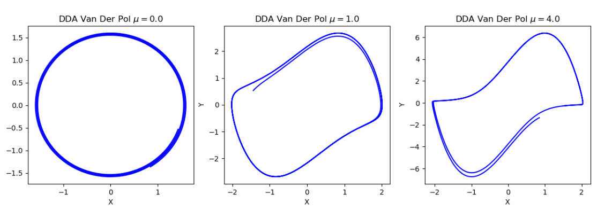

<!---

This file is used to generate your project datasheet. Please fill in the information below and delete any unused
sections.

You can also include images in this folder and reference them in the markdown. Each image must be less than
512 kb in size, and the combined size of all images must be less than 1 MB.
-->

## How it works

The DDA core expects to receive via SPI port the parameter for the van der Pol oscillator encoded in posit (16,1) padded with 2 zero bytes to compose a 32-bit word. When an SPI message is started by the master (SPI CS pin low) the integrators are clocked and solutions for both state variables, X and Y, are transmitted back serially via SPI as a single 32-bit word for each time step with the 16 bits MSB encoding X and the 16 bits 16 bits LSB encoding Y. Simulation can be stopped by stopping communication via SPI.

## How to test

In order to test chip reset the chip (RST_N active low) and start a duplex SPI communication transmitting 32-bit word with the van der Pol parameter $\mu$ encoded in posit (16,1) using the 16 bits LSB of the 32-bit word (padded with zeros). A controller software to interface with the chip via FTDI FT232H using SPI is available at [https://github.com/adonairc/tt07-dda-van-der-pol](https://github.com/adonairc/tt07-dda-van-der-pol)

## External hardware

This projects uses the top row pins of PMOD for SPI:

uio[0] - CS\
uio[1] - MOSI\
uio[2] - MISO\
uio[3] - SCK
